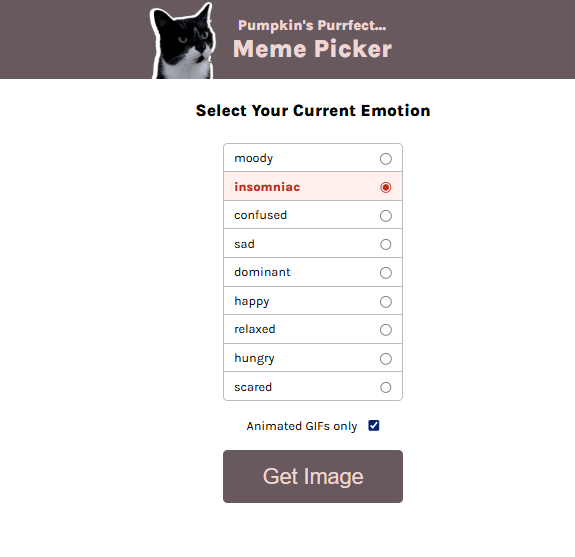
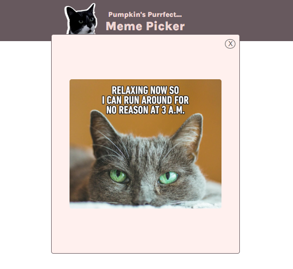

# 🎃 Pumpkin's Purrfect Meme Picker

A delightful web application that helps you find the perfect cat meme based on your current emotion! Whether you're feeling moody, happy, confused, or anything in between, Pumpkin has got the right cat image for you.





## 🚀 Live Demo

**[View Live Demo](https://kvothe1387.github.io/Purrfect-meme-picker/)**

## ✨ Features

- **Emotion-Based Selection**: Choose from 8 different emotions including happy, sad, moody, confused, scared, hungry, relaxed, dominant, and insomniac
- **Static Images & GIFs**: Toggle between static images and animated GIFs
- **Smart Filtering**: Advanced filtering system that matches cats based on emotion tags
- **Responsive Modal**: Clean, centered modal display for selected cat images
- **Random Selection**: When multiple cats match your emotion, one is randomly selected
- **Interactive UI**: Highlighted selection states and smooth user interactions

## 🛠️ Technologies Used

- **HTML5**: Semantic markup structure
- **CSS3**: Custom styling with flexbox layouts and responsive design
- **Vanilla JavaScript**: DOM manipulation and event handling
- **ES6 Modules**: Modular code organization
- **Google Fonts**: Karla font family for typography

## 📁 Project Structure

```
Purrfect-meme-picker/
├── index.html          # Main HTML structure
├── index.css           # Styling and layout
├── index.js            # Main JavaScript functionality
├── data.js             # Cat data array with emotions and images
├── images/             # Directory containing cat images and GIFs
│   ├── pumpkin.png     # Header mascot image
│   ├── *.jpeg          # Static cat images
│   └── *.gif           # Animated cat GIFs
└── README.md           # This file
```

## 🐱 How It Works

1. **Select Your Emotion**: Choose from the radio button options that match how you're currently feeling
2. **Choose Format** (Optional): Check "Animated GIFs only" if you prefer moving images
3. **Get Your Meme**: Click the "Get Image" button to receive your perfect cat meme
4. **View & Close**: The selected image appears in a modal overlay - click X to close

## 🎨 Emotion Categories

The app includes cats for these emotions:
- **Happy** - Cheerful and content cats
- **Sad** - Melancholy feline expressions  
- **Moody** - Grumpy and attitude-filled cats
- **Confused** - Bewildered and puzzled expressions
- **Scared** - Nervous and frightened cats
- **Hungry** - Food-focused feline moments
- **Relaxed** - Chill and laid-back cats
- **Dominant** - Confident and assertive expressions
- **Insomniac** - Tired and sleepy cats

## 🔧 Key JavaScript Features

- **Dynamic Radio Generation**: Emotions are dynamically generated from the data array
- **Smart Filtering Algorithm**: Filters cats based on both emotion tags and GIF preference
- **Random Selection**: Uses `Math.random()` for variety when multiple options exist
- **Event-Driven Architecture**: Efficient event handling for user interactions
- **Modal Management**: Clean modal open/close functionality

## 🎯 Code Highlights

The project demonstrates several programming concepts:
- **Array Methods**: Extensive use of `filter()`, `includes()`, and `map()`
- **DOM Manipulation**: Dynamic HTML generation and element selection
- **Event Handling**: Click and change event listeners
- **Conditional Logic**: Smart filtering based on user preferences
- **Modular Design**: Separation of data, logic, and presentation

## 🚀 Getting Started

1. Clone the repository
2. Open in VS Code or your preferred editor
3. Use a live server extension to serve the files locally
4. Or simply open `index.html` in your browser

## 🌟 Future Enhancements

Potential improvements could include:
- Additional emotion categories
- User-uploaded cat images
- Favorite cats functionality
- Social sharing capabilities
- Mobile-optimized touch interactions
- Dark/light theme toggle

## 📄 License

This project is open source and available under the [MIT License](LICENSE).

## 🤝 Contributing

Feel free to fork this project and submit pull requests for any improvements!

## 👏 Acknowledgments

- Cat images and GIFs sourced from various internet collections
- Inspired by the universal need for cat memes in our daily lives
- Built with love for our feline friends 🐾

---

*Made with ❤️ and lots of cat videos*